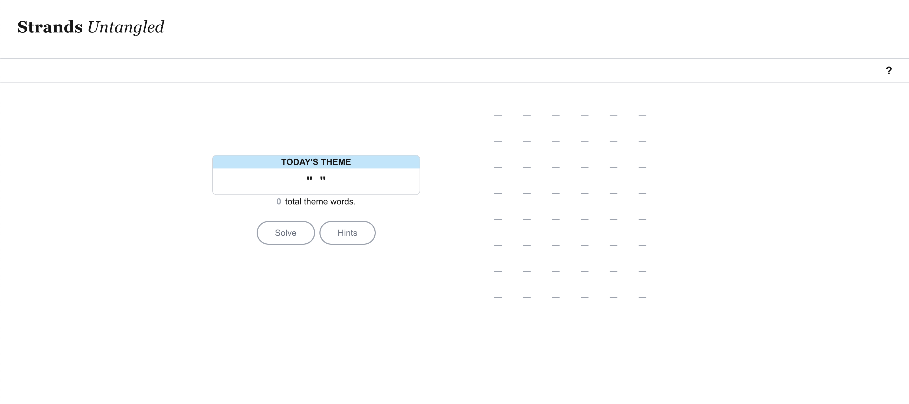
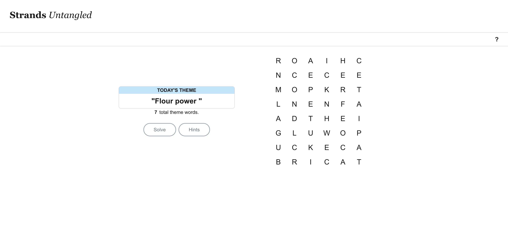
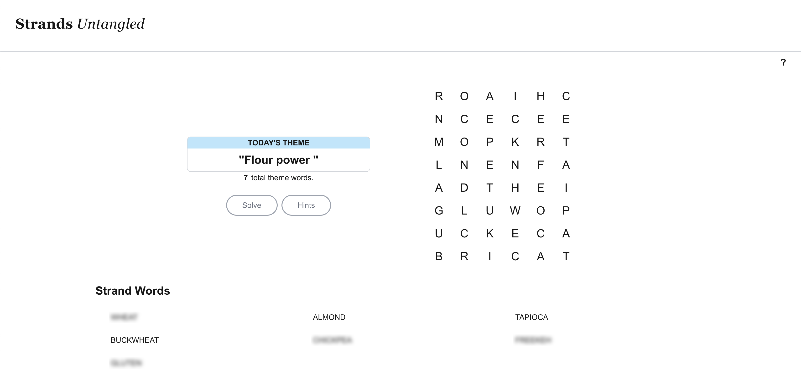
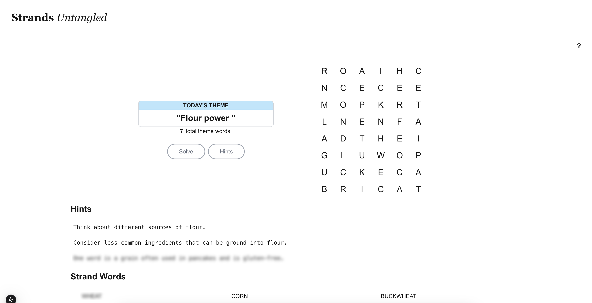

# StrandsUntangled

Stands Untangled is a simple app to solve NYT Strands puzzles. 

## The App

StandsUntangled mimics the feel of Stands to provide the input for solving. To begin, start by filling out the theme of the day, the letters on the board, and the total number of words to be found. 

Once filled out, you have two options, to solve or retrieve hints. Pressing `Solve` will return the guessed puzzle words blurred out. Each word can be pressed to remove the obfuscation and reveal the guess. If you  would like a hint of what the words are, the `Hints` button can be chosen. In addition to returning the solved words, the app will also return 3 hints that get progressively more specific. Each hint also is blurred and can be revealed by tapping. 

*Solved Board with guessed words revealed.*

*Solved Board with hints displayed.*

## About

StandsUntangled uses a BFS algorithm with a trie tree to find all possible valid english words on the board. Once found, the words are added to an LLM prompt that returns the most puzzle's solution words based on the given theme context. When hints are chosen, the LLM will generate the hints based on the words it selected to most likely be the solution.

### Limitations

- Words
  - The words the can be chosen are limited to the word dataset in `./src/app/data/valid_words.txt`. This means if the Spanagram is two words, or a word isn't in the word list, the solution won't return it. 
- Hallucination
  - Occasionally in testing, the app would return words that couldn't be made on the board, trying to return words based on what it thought should represent the theme.
- Wrong Theme
  - The LLM may also guess the theme incorrectly and return words that don't actually fit the provided theme. 

Read my project review!  
*Coming Soon!*
